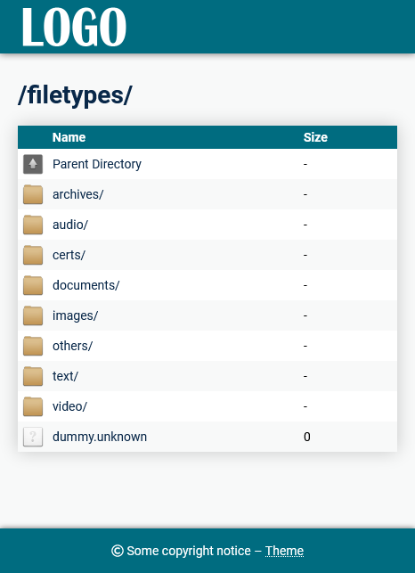
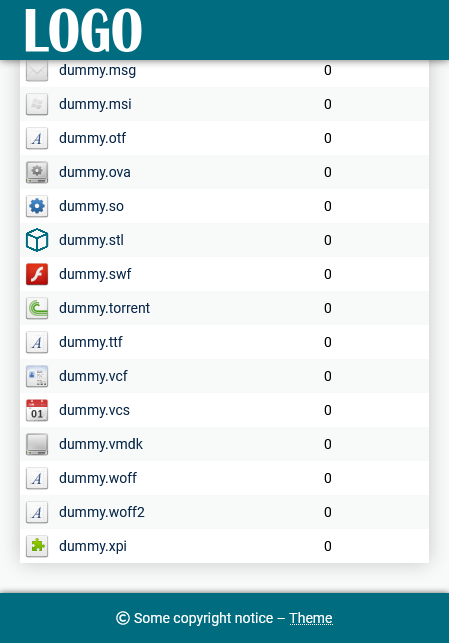
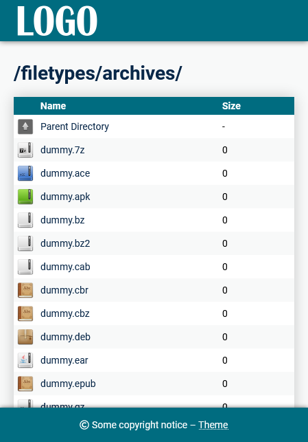

## pólýfónía

- Style for Apache's `mod_autoindex`
- mobile friendly
- CSS/HTML only, no JS, no PHP
- matching error page included
- icons for many files extensions (see `LICENSE` for their source)



## How to deploy

#### Disclaimer

Of course, they're many ways to deploy such a style.

The following procedure will place the theme **outside** your `DocumentRoot`. 

While more convenient for some (no need to hide the style's folder with `IndexIgnore`, lower the network load if `DocumentRoot` is a NFS mount), this may not be suited for ones using a shared hosting, where only `.htaccess` are allowed.

#### Operations

Ensure that `mod_autoindex` and `mod_include` are enabled.

- On Ubuntu: `a2enmod autoindex include`
- Or uncomment these line on your `httpd.conf`/`apache2.conf`:

```
LoadModule autoindex_module /usr/lib/apache2/modules/mod_autoindex.so
LoadModule include_module /usr/lib/apache2/modules/mod_include.so
```

Copy the contents of the `dist` folder from this repo to a directory on your server. In this example, we'll use `/home/user/polyfonia`. Be sure that Apache has read permissions on it.

Copy `polyfonia.conf` from the `conf` folder from this repo to a directory on your server. In this example, we'll use `/home/user/polyfonia.conf`. Be sure that Apache has read permissions on it.

In `/home/user/polyfonia`, replace `logo.png` by the logo you want to use in the header.

In `/home/user/polyfonia/header.shtml`, replace `###TITLE###` by the title that will be displayed in your browser tabs.

In `/home/user/polyfonia/footer.shtml`, replace `###COPYRIGHT###` by the copyright text that will be displayed in the footer.

Edit your Apache configuration :

- Add `+Indexes` to your `DocumentRoot` options
- Include the style configuration file
- Configure options for the directory where you uploaded the style (`+Includes` and `Require all granted`)
- In your `VirtualHost`, add the `/.polyfonia` alias pointing to the style directory
- In your `VirtualHost`, you may also add the optional `ErrorDocument`

Your configuration should look like this:

```
<Directory /var/www>
    Options +Indexes +FollowSymLinks
</Directory>

<Directory /home/user/polyfonia>
    Options +Includes
    Require all granted
</Directory>

<VirtualHost *:80>
    DocumentRoot /var/www

	Alias "/.polyfonia" "/home/user/polyfonia"
	ErrorDocument 400 /.polyfonia/404.shtml
	ErrorDocument 401 /.polyfonia/404.shtml
	ErrorDocument 403 /.polyfonia/404.shtml
	ErrorDocument 404 /.polyfonia/404.shtml
	ErrorDocument 408 /.polyfonia/404.shtml
	ErrorDocument 500 /.polyfonia/404.shtml
	ErrorDocument 502 /.polyfonia/404.shtml
	ErrorDocument 503 /.polyfonia/404.shtml
	ErrorDocument 504 /.polyfonia/404.shtml
	Include /home/user/polyfonia.conf

	etc...
</VirtualHost>
```

Restart Apache and voilà !


